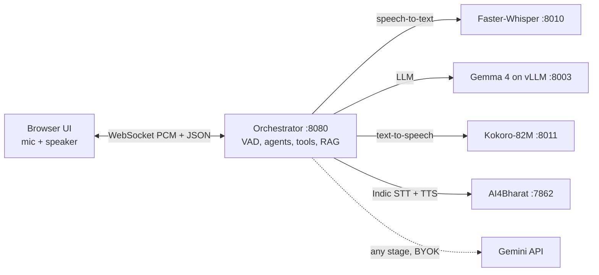

# Voice Agent Studio

A self-hosted studio for building and testing real-time voice agents. You talk to an agent in the browser. The agent listens, looks things up in your documents, calls your APIs, answers out loud, and can hand the call to a human.

The whole pipeline runs on your own GPUs with open models. You can also switch any stage to the Google Gemini API with your own key, which runs everything, Indic languages included, on a laptop with no GPU.

## Features

- **Streaming voice loop.** Voice activity detection, barge-in (interrupting the agent while it talks), sentence-by-sentence text-to-speech, and live token streaming to the UI.
- **Multiple agents.** Each agent has its own instructions, voice, language, speed, tools and document scope. Agents can hand a caller to each other.
- **Tools.** Define APIs as mock responses or as real HTTP calls pasted in as cURL. The agent calls them mid-conversation while hold audio plays.
- **Human handoff.** A built-in `redirect_to_human` tool queues the call for an operator console at `/human`, with live two-way audio.
- **Document RAG.** Upload folders or zips of PDF, DOCX, HTML, CSV, text or images (OCR). Answers are grounded in the documents each agent is scoped to.
- **28 languages.** English, Hindi, Spanish, French, German, Japanese and Chinese, plus 21 more Indic languages through AI4Bharat models.
- **Choice of model provider.** Local open models, or Gemini (bring your own key) per stage: speech-to-text, LLM, text-to-speech.

## Architecture



| Component | File | Model | Port |
|---|---|---|---|
| Orchestrator + UI | `app/` (`python -m app.main`) | - | 8080 |
| Speech-to-text | `services/stt_server.py` | Faster-Whisper large-v3-turbo | 8010 |
| LLM | `scripts/start_gemma4.sh` (vLLM) | `google/gemma-4-31B-it` | 8003 |
| Text-to-speech | `services/tts_server.py` | Kokoro-82M | 8011 |
| Indic speech | `services/indic_server.py` | IndicConformer 600M + Indic Parler-TTS | 7862 |

All model calls go through `app/providers.py`. Endpoints and defaults live in `app/config.py`.

## Quick start: Gemini mode (no GPU)

Needs Python 3.10+. The core install is about 25 small packages (no torch, no CUDA).

```bash
git clone https://github.com/SasiPreethamR/voice-agent-studio && cd voice-agent-studio
python3 -m venv .venv && . .venv/bin/activate
pip install -r requirements.txt
MODEL_PROVIDER=gemini python -m app.main
```

1. Open http://localhost:8080. Browsers only allow the microphone on `localhost` or over HTTPS.
2. The Model settings dialog opens by itself. Paste a key from [Google AI Studio](https://aistudio.google.com/apikey), click **Test**, then **Save**.
3. Go to **Agents**, create an agent, then press **Start** in the Sandbox.

`MODEL_PROVIDER=gemini` marks the deployment as Gemini-only. Every stage uses Gemini, the UI hides the local-stack option, and the server stops probing GPU services. You can also put it in `.env` instead of the command line.

The key stays in your browser's local storage. It is sent to the orchestrator with each call and never written to disk. To use one server-side key for everyone instead, set `GEMINI_API_KEY` in `.env`.

Each spoken turn makes several API calls: one transcription, one or two LLM calls, and one text-to-speech call per sentence. Free-tier rate limits are reached quickly.

For PDF, DOCX, OCR and semantic embeddings, add `pip install -r requirements-docs.txt`. This pulls in torch through sentence-transformers. Without it, text, Markdown, CSV, XLSX, HTML and ZIP uploads still work, and retrieval uses keyword full-text search plus a lightweight hashing embedder.

## Full local stack (GPUs)

Tested on Linux with NVIDIA GPUs. Gemma 4 31B uses two H200-class GPUs by default (tensor parallel, long context), and the speech services fit on one more.

```bash
pip install -r requirements.txt -r requirements-docs.txt -r requirements-gpu.txt
cp .env.example .env        # add HF_TOKEN; adjust GPU placement
bash scripts/start_all.sh   # LLM, STT, TTS, Indic server, orchestrator
bash scripts/stop_all.sh
```

- Each service runs as a `systemd --user` unit, so it survives SSH disconnects (needs `loginctl enable-linger`). Logs go to `logs/`.
- Start or stop services individually with `scripts/start_<name>.sh` / `scripts/stop_<name>.sh`.
- GPU placement is set with `LLM_GPUS`, `STT_GPU`, `TTS_GPU` and `INDIC_GPU`. See `.env.example`.
- The Indic server needs a pinned `transformers` version. See [services/indic/instructions.md](services/indic/instructions.md).
- In this mode (`MODEL_PROVIDER=local`, the default) each browser can still switch individual stages to Gemini in Model settings. For example, keep Whisper and Kokoro local and use Gemini only as the LLM.

### HTTPS

To use the microphone from another machine, put a certificate at `cert.pem` / `key.pem` in the repo root. The orchestrator switches to HTTPS automatically; set `HTTPS=0` to force plain HTTP, and `PORT` to change the port:

```bash
openssl req -x509 -newkey rsa:2048 -sha256 -days 825 -nodes \
  -keyout key.pem -out cert.pem -subj "/CN=$(hostname)"
```

## Configuration

Settings come from environment variables or a `.env` file in the repo root; see [.env.example](.env.example). Agents, tools, handoffs and uploaded documents are stored in `data/`, which is created on first run and is gitignored.

Optional assets:
- `app/static/hold_music.mp3`: looping music played while a tool runs or while the caller waits for a human. Not included; use any MP3 you have the rights to.
- `app/static/tool_wait.pcm`: short spoken cue (24 kHz, 16-bit mono PCM) played when a tool starts.

## Project layout

```
app/                     orchestrator: what you run (python -m app.main)
├── main.py              FastAPI app, routers, static UI
├── voice.py             /ws/voice call loop: VAD, barge-in, STT -> LLM -> streamed TTS
├── tools.py             API tool library and execution (mock, cURL, switch_agent)
├── agents.py            agent definitions
├── handoff.py           human handoff queue, operator console socket, audio relay
├── api.py               REST API: documents, tools, agents, model provider, health
├── providers.py         STT / LLM / TTS calls for the local stack and Gemini
├── documents.py         document parsing, chunking, embeddings, retrieval (SQLite)
├── config.py            endpoints, model defaults, .env loading
└── static/              Studio UI (index.html) and operator console (human.html)
services/                optional self-hosted model servers (GPU)
├── stt_server.py        Faster-Whisper, OpenAI-compatible
├── tts_server.py        Kokoro, OpenAI-compatible
├── indic_server.py      AI4Bharat ASR + TTS
└── indic/               Indic server docs, requirements, playground UI
scripts/                 start_*.sh / stop_*.sh service launchers (systemd --user)
data/                    runtime state, created on first run (gitignored)
```

## License

[Apache License 2.0](LICENSE). Model weights are downloaded separately and keep their own licenses: Gemma, Whisper, Kokoro and the AI4Bharat models. Gemini API use is subject to Google's terms.
